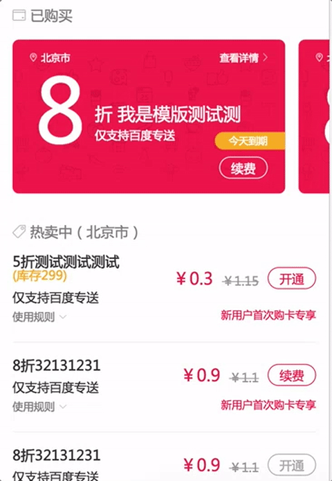

## fis3+react+react-router+redux单页面应用实践

基于 [fis3+react+redux+react-router](https://github.com/younth/fis3-react-redux-spa) 的单页面应用，目前应用在多个移动端业务线。

***注意：***

- 本项目为剥离业务代码后的架子，只保留了基础UI样式及交互，demo中的数据全部是mock出来的。
- 当前分支基于`fis3`构建，如果你使用的是`webpack`，直接切到该项目的`webpack`分支。
- 喜欢的话化请`star`支持下~

单页面效果：



### 安装启动

本项目构建基于`fis3`，不熟悉`fis3`的可以先去学习下。[传送门](http://fis.baidu.com/)

- 安装依赖包 `npm i --registry=https://registry.npm.taobao.org`，指定淘宝源可加速按照依赖
- 启动fis3 server服务 fis3 server start
- 将代码推到fis3 server www文件中 fis3 release -cwL 修改代码可以自动刷新浏览器

### 技术栈

- fis3
- react
- redux
- react-router
- es6
- fetch

### 代码检测

    npm run lint

### 项目目录结构

```
project
  ├─ node_modules   (npm模块)  
  ├─ app    (工程模块)
  │  ├─ actions  (获取数据并流向stores)
  │  │  └─ more
  │  ├─ components (组件)
  │  │  └─ more
  │  ├─ reducers  (每个store)
  │  │  ├─ index
  │  │  └─ detail
  │  └─ containers (页面)
  │     ├─ header
  │     └─ footer
  │  └─ router       (路由)
  │     ├─ cardDetail
  ├─ static    (非业务相关资源)
  │  ├─ lib  
  │  ├─ img
  │  ├─ js
  │  ├─ css
  ├─ config (配置)
     └─ server.conf （mock数据）
  ├─ fis-conf.js   (fis3编译配置)
  ├─ .eslintrc.json   (eslint配置)
  ├─ index.html   (入口文件)
  ...

```

### 组件化设计

要降低系统设计的复杂度，前端目前最好的方式就是组件化。将系统划分成若干个页面，然后将每个页面都划分成若干个组件，还要抽象出多个页面中都会用到的通用组件，这是第一步。接下来要看组件和组件之间如何传递数据，即数据管理和状态管理该如何做。


但是最后在开发过程中忽略了一个问题，就是一些复杂页面，光这种“页面 - 组件”的形式是不够的，应该在加一个subpage层，这样就扩展性更好一些了。如下图：


总结：一个项目总会遇到个别的比较复杂的页面，因此这种page - subpage - component会更加合理一些，其中的subpage在不需要的时候省略掉就是了。

### 数据请求管理

#### 直接请求

这种形式，直接在业务的请求回调中处理。

- 系统数据，通过action的方法修改store的值
- 业务数据，更改业务组件的state值


```
getData().then(res => {
    return res.json()
}).then(json => {
    if (json.errno !== 0) {
        console.error('errno:' + json.errno);
        return;
    }
    var data = json.data;
    // 通过回调，更新系统数据
    this.props.collectlistActions.update(news)
    // 更改业务数据
    this.setState({hotnews: json.data.slice(1, 4)})
})

```

#### redux-thunk 中间件形式

通过`configureStore.js`去关联action与store

```
// 调用
actions.getCardList()

//获取标签列表.
export const getCardList = () =>{
  return {
    type: types.Card_LIST,
    promise: api.getTagList()
  }
}

// cardList reducer
import * as actionTypes from '../constants/types'

export default function card(state = initialState, action) {
    switch (action.type) {
        case actionTypes.GET_HOMECARD_REQUEST:
            return {
                ...state,
                loading: true
            }
        case actionTypes.GET_HOMECARD_SUCCESS:
            let result = action.json.result
            return {
                ...state,
            }
        case actionTypes.GET_HOMECARD_FAILURE:
            // error_no 不等于0
            return {
                ...state,
            }
        default:
            return state
    }
}

```
